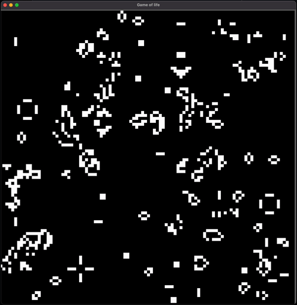

# Game of life

Game of life implementation in bevy.

## Instructions to use.

<center>

</center>

Run the program with the following

```bash
cargo run
```

## Keyboard shortcuts to control.

### SPACE

It toggles the game state to play hit space.

### R

It randomizes all the cell's state.

### Left mouse click

It toggles the cell state.
